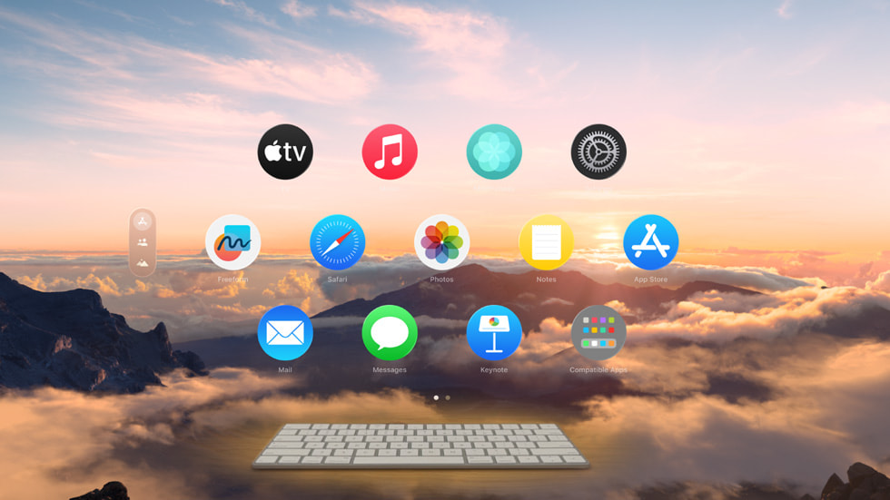

# visionOS Portfolio Hub

A personal portfolio application built natively for Apple Vision Pro using SwiftUI. This app showcases spatial UI concepts and presents professional information in an interactive format designed for visionOS.

## Showcase Video

[](https://vimeo.com/1075860453/7ae129af4d?ts=0&share=copy)

## Technologies Used

*   **Platform:** visionOS 1.0+
*   **UI Framework:** SwiftUI
*   **Language:** Swift

## Setup & Running

1.  Clone this repository: `git clone https://github.com/viachaslauhryniuk/visionOS-Portfolio-Hub.git`
2.  Open the `Calc.xcodeproj` file in Xcode (version 15.2 or later recommended).
3.  Ensure you have the visionOS SDK installed via Xcode.
4.  Select a visionOS Simulator (or a connected Apple Vision Pro device).
5.  Build and run (Cmd+R).

## Project Structure

The project follows a component-based architecture, separating features and reusable elements:
```plaintext
.
├── App
│   └── WindowIdentifiers.swift     # Core App Config (Window IDs)
├── Assets.xcassets               # Images
├── Data
│   ├── PageContent.swift         # Models & Data Source
│   ├── PortfolioData.swift
│   └── PortfolioItem.swift
├── Features
│   ├── About                     # App Screens (Features)
│   │   ├── AboutMeView.swift
│   │   └── Subviews
│   │       ├── ExperienceItemSimple.swift
│   │       ├── LanguageBadge.swift
│   │       ├── SectionView.swift
│   │       └── SkillTags.swift
│   ├── Contact
│   │   ├── ContactButtonContent.swift
│   │   └── ContactView.swift
│   └── Hub
│       ├── AvatarPageView.swift
│       ├── HubView.swift
│       ├── PaginationDots.swift
│       └── PortfolioItemView.swift
├── Utilities
│   └── FlowLayout.swift            # Shared Components
└── YourPortfolioAppApp.swift       # App Entry Point
